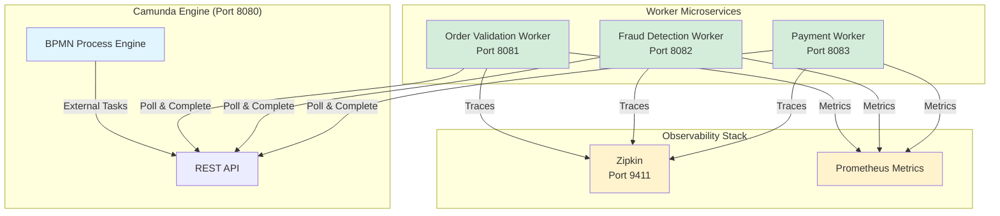
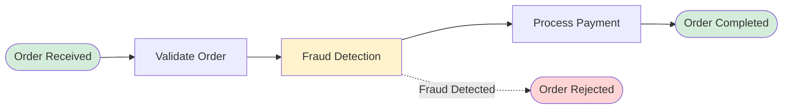
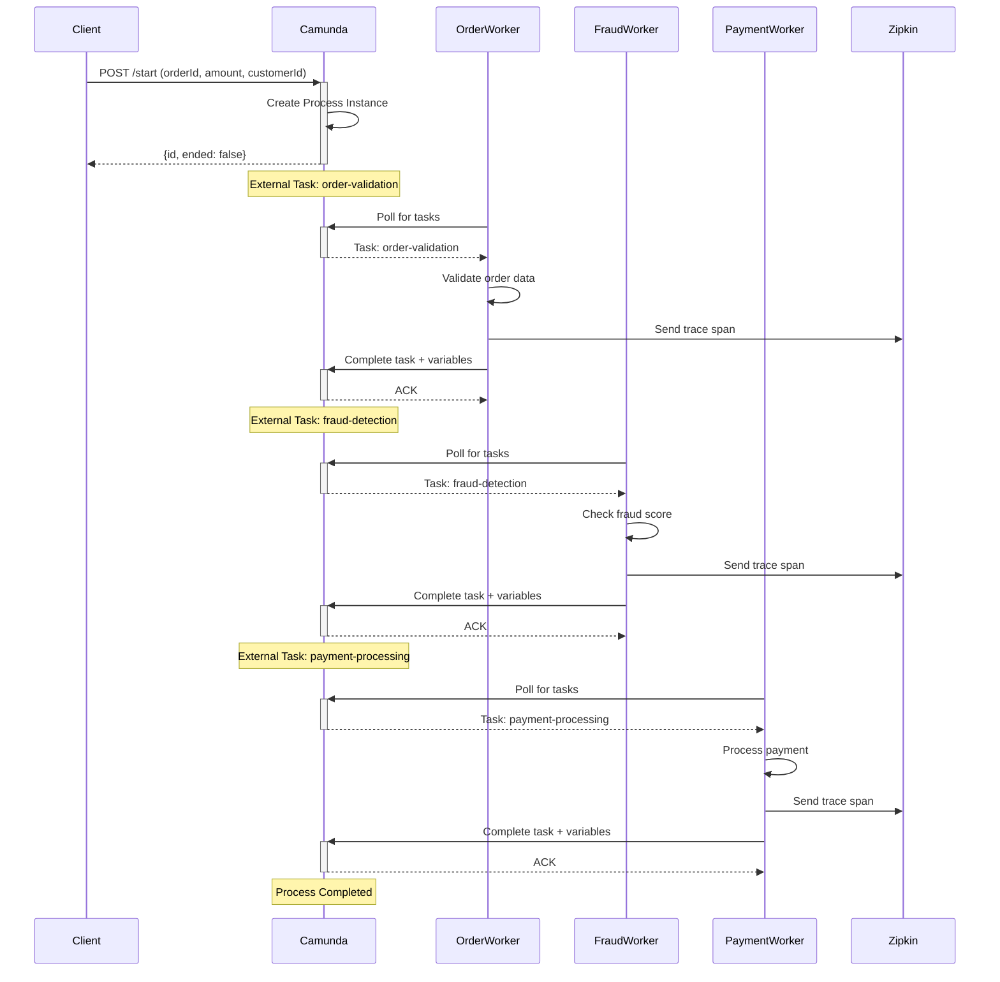
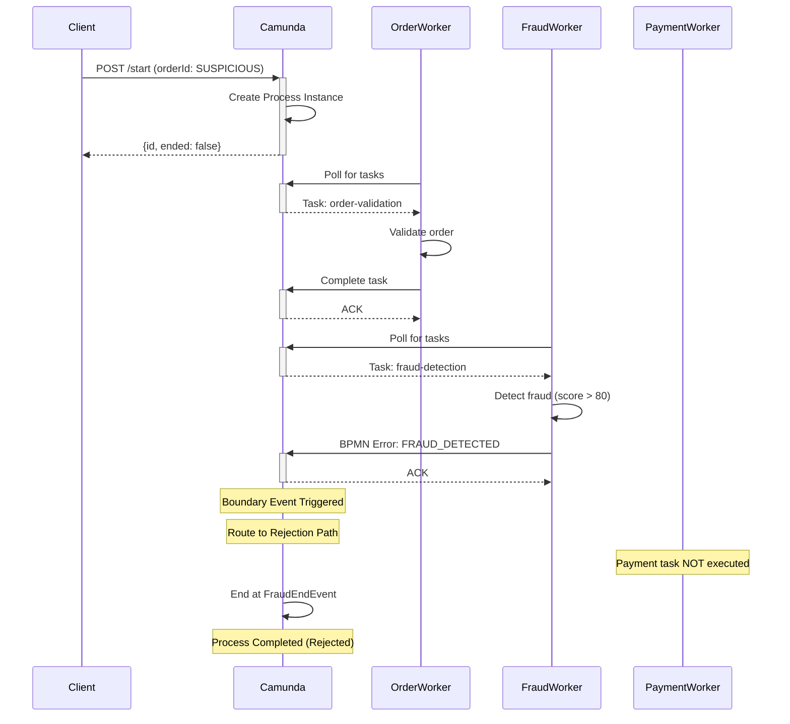
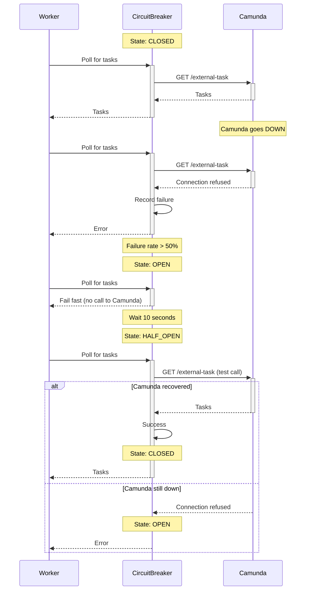
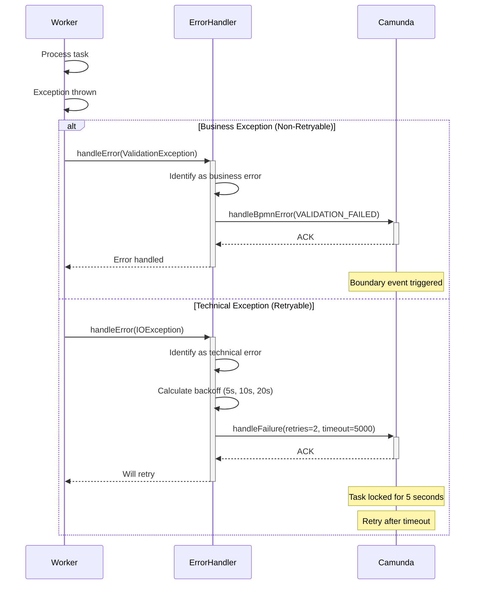

# Camunda External Task Pattern Demo

Production-ready Spring Boot microservices demonstrating Camunda BPM External Task Pattern with comprehensive observability, resilience, and monitoring.

## Table of Contents
- [Overview](#overview)
- [Architecture](#architecture)
- [Design Patterns](#design-patterns)
- [Features](#features)
- [Prerequisites](#prerequisites)
- [Quick Start](#quick-start)
- [API Documentation](#api-documentation)
- [Use Cases](#use-cases)
- [Monitoring & Observability](#monitoring--observability)
- [Exception Handling](#exception-handling)
- [Testing](#testing)
- [Troubleshooting](#troubleshooting)

---

## Overview

This project demonstrates a production-ready implementation of Camunda's External Task Pattern with three independent worker microservices:

- **Order Validation Worker** (Port 8081) - Validates order data
- **Fraud Detection Worker** (Port 8082) - Detects fraudulent transactions
- **Payment Worker** (Port 8083) - Processes payments
- **Camunda Engine** (Port 8080) - BPMN process orchestration

### Key Benefits

✅ **Loose Coupling** - Workers are independent microservices  
✅ **Hot Deployment** - Deploy workers without restarting engine  
✅ **Horizontal Scaling** - Scale workers independently  
✅ **Technology Freedom** - Workers can use different tech stacks  
✅ **Resilience** - Circuit breakers and retry mechanisms  
✅ **Observability** - Distributed tracing and metrics  

---

## Architecture

### High-Level Architecture



### BPMN Process Flow



---

## Design Patterns

### 1. External Task Pattern

Workers poll Camunda for tasks instead of Camunda pushing tasks to workers.

**Benefits:**
- Workers control their own load
- No network configuration needed (workers initiate connection)
- Easy to add/remove workers dynamically

### 2. Circuit Breaker Pattern

Prevents cascading failures when Camunda Engine is unavailable.

**States:**
- **CLOSED** - Normal operation
- **OPEN** - Failing fast, not calling Camunda
- **HALF_OPEN** - Testing if Camunda recovered

**Configuration:**
```properties
resilience4j.circuitbreaker.instances.camunda.failureRateThreshold=50
resilience4j.circuitbreaker.instances.camunda.waitDurationInOpenState=10s
resilience4j.circuitbreaker.instances.camunda.slidingWindowSize=10
```

### 3. Retry Pattern with Exponential Backoff

Automatically retries failed tasks with increasing delays.

**Retry Schedule:**
- 1st retry: 5 seconds
- 2nd retry: 10 seconds
- 3rd retry: 20 seconds

### 4. Correlation ID Pattern

Tracks requests across all microservices using unique correlation IDs.

**Log Format:**
```
[service-name,traceId,spanId] message
```

---

## Features

### Core Features

✅ **External Task Pattern** - Decoupled worker architecture  
✅ **BPMN Error Handling** - Business errors trigger BPMN error events  
✅ **Technical Error Handling** - Automatic retries with exponential backoff  
✅ **Distributed Tracing** - OpenTelemetry + Zipkin integration  
✅ **Circuit Breakers** - Resilience4j for fault tolerance  
✅ **Health Checks** - Kubernetes-ready liveness/readiness probes  
✅ **Metrics** - Custom metrics + Prometheus export  
✅ **Structured Logging** - Correlation IDs and trace context  
✅ **REST APIs** - Worker info and health endpoints  
✅ **Swagger/OpenAPI** - Interactive API documentation  

### Observability Features

- **Distributed Tracing** - Trace requests across all workers
- **Custom Metrics** - Task processing metrics per worker
- **Health Indicators** - Camunda connectivity status
- **Circuit Breaker Metrics** - State transitions and failure rates
- **JVM Metrics** - Memory, threads, GC stats
- **Log Aggregation** - Structured logs with correlation IDs

---

## Prerequisites

- Java 21+
- Maven 3.8+
- Docker (for Zipkin)
- curl or Postman (for testing)

---

## Quick Start

### 1. Start Zipkin (Distributed Tracing)

```bash
docker-compose -f docker-compose-zipkin.yml up -d
```

Verify: http://localhost:9411

### 2. Start Camunda Engine

```bash
cd camunda-engine
mvn spring-boot:run
```

Verify: http://localhost:8080/camunda

**Access Camunda Cockpit:**
- URL: http://localhost:8080/camunda/app/cockpit/default/
- Username: `admin`
- Password: `admin`

**Cockpit Features:**
- **Dashboard** - Overview of running and completed processes
- **Processes** - View process definitions and instances
- **Decisions** - DMN decision tables
- **Deployments** - Deployed BPMN files

**Access Process History Viewer:**
- URL: http://localhost:8080/process-history-viewer.html
- **Features:**
  - ✅ View all process instances (running + completed)
  - ✅ Filter by Running or Completed
  - ✅ See process details and variables
  - ✅ View execution activities and durations
  - ✅ Real-time refresh
  - ✅ No login required

### 3. Start Workers

```bash
# Terminal 2
cd order-validation-worker
mvn spring-boot:run

# Terminal 3
cd fraud-detection-worker
mvn spring-boot:run

# Terminal 4
cd payment-worker
mvn spring-boot:run
```

### 4. Verify Health

```bash
curl http://localhost:8081/actuator/health | jq
curl http://localhost:8082/actuator/health | jq
curl http://localhost:8083/actuator/health | jq
```

Expected output:
```json
{
  "status": "UP",
  "components": {
    "camunda": {
      "status": "UP"
    },
    "circuitBreakers": {
      "status": "UP"
    }
  }
}
```

---

## API Documentation

### Camunda Engine REST API

| Endpoint | Method | Description |
|----------|--------|-------------|
| `/engine-rest/process-definition/key/{key}/start` | POST | Start process instance |
| `/engine-rest/history/process-instance/{id}` | GET | Get process history |
| `/engine-rest/history/activity-instance` | GET | Get activity history |

### Worker REST APIs

All workers expose the same endpoints:

| Endpoint | Method | Description |
|----------|--------|-------------|
| `/api/info` | GET | Worker information |
| `/api/health` | GET | Worker health status |
| `/actuator/health` | GET | Detailed health check |
| `/actuator/metrics` | GET | Available metrics |
| `/actuator/prometheus` | GET | Prometheus format metrics |

### Swagger UI

Access interactive API documentation:

- Order Validation: http://localhost:8081/swagger-ui.html
- Fraud Detection: http://localhost:8082/swagger-ui.html
- Payment: http://localhost:8083/swagger-ui.html

---

## Use Cases

### Use Case 1: Normal Order Processing (Happy Path)

**Scenario:** Customer places a valid order with normal amount.

**Steps:**
1. Order validation passes
2. Fraud check passes
3. Payment processes successfully
4. Order completed

**Test Command:**
```bash
curl -X POST http://localhost:8080/engine-rest/process-definition/key/order-process/start \
  -H "Content-Type: application/json" \
  -d '{
    "variables": {
      "orderId": {"value": "ORDER-12345", "type": "String"},
      "amount": {"value": 99.99, "type": "Double"},
      "customerId": {"value": "CUST-001", "type": "String"}
    }
  }'
```

**Expected Result:**
```json
{
  "id": "process-instance-id",
  "ended": false
}
```

**Verify Completion:**
```bash
# Wait 10 seconds, then check
curl http://localhost:8080/engine-rest/history/process-instance/{id} | jq '{state, durationInMillis}'
```

Expected:
```json
{
  "state": "COMPLETED",
  "durationInMillis": 4800
}
```

**Check Activities:**
```bash
curl http://localhost:8080/engine-rest/history/activity-instance?processInstanceId={id} | jq '[.[] | select(.activityType == "serviceTask") | .activityName]'
```

Expected:
```json
[
  "Validate Order",
  "Fraud Detection",
  "Process Payment"
]
```


### Use Case 2: Fraud Detection (Negative Path)

**Scenario:** Order contains suspicious patterns triggering fraud detection.

**Fraud Triggers:**
- Order ID contains "SUSPICIOUS"
- Amount > $50,000
- Random fraud score > 80

**Test Command:**
```bash
curl -X POST http://localhost:8080/engine-rest/process-definition/key/order-process/start \
  -H "Content-Type: application/json" \
  -d '{
    "variables": {
      "orderId": {"value": "ORDER-SUSPICIOUS-999", "type": "String"},
      "amount": {"value": 500.00, "type": "Double"},
      "customerId": {"value": "CUST-FRAUD", "type": "String"}
    }
  }'
```

**Expected Result:**
- Process ends at "Order Rejected (Fraud)" event
- Payment task is NOT executed
- BPMN error "FRAUD_DETECTED" is thrown

**Verify:**
```bash
curl http://localhost:8080/engine-rest/history/activity-instance?processInstanceId={id} | jq '[.[] | .activityName]'
```

Expected:
```json
[
  "Order Received",
  "Validate Order",
  "Fraud Detection",
  "Fraud Detected",
  "Order Rejected (Fraud)"
]
```

Note: "Process Payment" is NOT in the list (skipped due to fraud).

### Use Case 3: Validation Error (Retryable)

**Scenario:** Order validation fails due to missing data.

**Test Command:**
```bash
curl -X POST http://localhost:8080/engine-rest/process-definition/key/order-process/start \
  -H "Content-Type: application/json" \
  -d '{
    "variables": {
      "orderId": {"value": "", "type": "String"},
      "amount": {"value": 99.99, "type": "Double"},
      "customerId": {"value": "CUST-001", "type": "String"}
    }
  }'
```

**Expected Behavior:**
- Worker throws ValidationException
- Task retries with exponential backoff (5s, 10s, 20s)
- After 3 retries, task goes to incident state

**Check Incidents:**
```bash
curl http://localhost:8080/engine-rest/incident?processInstanceId={id} | jq
```

### Use Case 4: Circuit Breaker Test

**Scenario:** Camunda Engine becomes unavailable.

**Steps:**

1. Stop Camunda Engine (Ctrl+C)

2. Wait 30 seconds for workers to detect failures

3. Check circuit breaker state:
```bash
curl http://localhost:8081/actuator/health/circuitBreakers | jq
```

Expected:
```json
{
  "status": "DOWN",
  "components": {
    "circuitBreakers": {
      "status": "DOWN",
      "details": {
        "camunda": {
          "state": "OPEN",
          "failureRate": "100.0%"
        }
      }
    }
  }
}
```

4. Restart Camunda Engine

5. Circuit breaker transitions: OPEN → HALF_OPEN → CLOSED

6. Verify recovery:
```bash
curl http://localhost:8081/actuator/metrics/resilience4j.circuitbreaker.state | jq
```

### Use Case 5: Distributed Tracing

**Scenario:** Track a request across all microservices.

**Steps:**

1. Start a process and note the process instance ID

2. Check worker logs for trace IDs:
```
[order-validation-worker,abc123,def456] Task completed
[fraud-detection-worker,abc123,ghi789] Task completed
[payment-worker,abc123,jkl012] Task completed
```

3. Open Zipkin UI: http://localhost:9411/zipkin/

4. Search by:
   - Service name: `order-validation-worker`
   - Tag: `orderId=ORDER-12345`

5. Click on trace to see:
   - Timeline of all operations
   - Duration of each worker
   - Parent-child span relationships

### Use Case 6: Performance Monitoring

**Scenario:** Monitor worker performance and throughput.

**Check Metrics:**

```bash
# Tasks processed
curl http://localhost:8081/actuator/metrics/worker.tasks.processed | jq

# Success rate
curl http://localhost:8081/actuator/metrics/worker.tasks.succeeded | jq

# Failure rate
curl http://localhost:8081/actuator/metrics/worker.tasks.failed | jq

# Task duration (percentiles)
curl http://localhost:8081/actuator/metrics/worker.task.duration | jq
```

**Prometheus Format:**
```bash
curl http://localhost:8081/actuator/prometheus | grep worker
```

Expected output:
```
worker_tasks_processed_total{worker="order-validation"} 10.0
worker_tasks_succeeded_total{worker="order-validation"} 9.0
worker_tasks_failed_total{worker="order-validation"} 1.0
worker_task_duration_seconds_sum{worker="order-validation"} 45.2
```

### Use Case 7: Load Testing

**Scenario:** Test system under load.

**Generate 10 Orders:**
```bash
for i in {1..10}; do
  curl -s -X POST http://localhost:8080/engine-rest/process-definition/key/order-process/start \
    -H "Content-Type: application/json" \
    -d "{
      \"variables\": {
        \"orderId\": {\"value\": \"ORDER-LOAD-$i\", \"type\": \"String\"},
        \"amount\": {\"value\": $((50 + i * 10)).00, \"type\": \"Double\"},
        \"customerId\": {\"value\": \"CUST-$i\", \"type\": \"String\"}
      }
    }" > /dev/null
  echo "Started process $i"
done
```

**Monitor Metrics:**
```bash
watch -n 2 'curl -s http://localhost:8081/actuator/metrics/worker.tasks.processed | jq ".measurements[0].value"'
```

---

## Monitoring & Observability

### Camunda Cockpit (Web UI)

**Access Cockpit:**
```
http://localhost:8080/camunda/app/cockpit/default/
```

**Login Credentials:**
- Username: `admin`
- Password: `admin`

**Cockpit Limitations (Community Edition):**
- Shows only **running** process instances
- Completed processes are NOT visible in Cockpit
- History viewing requires Enterprise Edition

**Solution: Process History Viewer**

A custom HTML viewer is included to view completed processes:

```
http://localhost:8080/process-history-viewer.html
```

**History Viewer Features:**

1. **View All Processes:**
   - Running and completed instances
   - Process state, start/end times, duration
   - Statistics (total, completed, active)

2. **Filter Options:**
   - 🔄 Refresh - Reload all processes
   - ▶️ Running Only - Show active processes
   - ✅ Completed Only - Show finished processes

3. **Process Details:**
   - Click "📋 Details" to see:
     - Process definition
     - State and duration
     - All variables (orderId, amount, customerId, etc.)

4. **Activity History:**
   - Click "🔍 Activities" to see:
     - All executed activities
     - Activity names and types
     - Duration of each activity
     - Complete execution path

**Example Usage:**
```bash
# Start a process
curl -X POST http://localhost:8080/engine-rest/process-definition/key/order-process/start \
  -H "Content-Type: application/json" \
  -d '{
    "variables": {
      "orderId": {"value": "ORDER-123", "type": "String"},
      "amount": {"value": 99.99, "type": "Double"},
      "customerId": {"value": "CUST-001", "type": "String"}
    }
  }'

# Wait 10 seconds, then view in History Viewer
# Go to: http://localhost:8080/process-history-viewer.html
# Click "Refresh" to see the completed process
```

**Query Process History via REST API:**
```bash
# Get all completed processes
curl http://localhost:8080/engine-rest/history/process-instance?finished=true | jq

# Get specific process
curl http://localhost:8080/engine-rest/history/process-instance/{id} | jq

# Get process activities
curl http://localhost:8080/engine-rest/history/activity-instance?processInstanceId={id} | jq

# Get process variables
curl http://localhost:8080/engine-rest/history/variable-instance?processInstanceId={id} | jq
```

### Health Checks

**Liveness Probe:**
```bash
curl http://localhost:8081/actuator/health/liveness
```

**Readiness Probe:**
```bash
curl http://localhost:8081/actuator/health/readiness
```

**Kubernetes Configuration:**
```yaml
livenessProbe:
  httpGet:
    path: /actuator/health/liveness
    port: 8081
  initialDelaySeconds: 30
  periodSeconds: 10

readinessProbe:
  httpGet:
    path: /actuator/health/readiness
    port: 8081
  initialDelaySeconds: 10
  periodSeconds: 5
```

### Distributed Tracing (Zipkin)

**Access Zipkin UI:**
```
http://localhost:9411/zipkin/
```

**Search Options:**
- Service name: Select worker
- Span name: Task operation
- Tags: orderId, customerId, amount
- Duration: Min/max duration filter

**Trace Details:**
- Timeline view of all spans
- Duration of each operation
- Tags and annotations
- Error details if any

### Metrics Endpoints

**Available Metrics:**
```bash
curl http://localhost:8081/actuator/metrics | jq '.names'
```

**Custom Worker Metrics:**
- `worker.tasks.processed` - Total tasks processed
- `worker.tasks.succeeded` - Successful tasks
- `worker.tasks.failed` - Failed tasks
- `worker.task.duration` - Task processing time

**Circuit Breaker Metrics:**
- `resilience4j.circuitbreaker.state` - Current state
- `resilience4j.circuitbreaker.failure.rate` - Failure percentage
- `resilience4j.circuitbreaker.calls` - Total calls

**JVM Metrics:**
- `jvm.memory.used` - Memory usage
- `jvm.threads.live` - Active threads
- `jvm.gc.pause` - GC pause time

### Log Aggregation

**Log Format:**
```
2026-03-04 20:50:46.123 INFO [order-validation-worker,abc123,def456] Task completed | orderId=ORDER-12345 | duration=1130ms
```

**Log Levels:**
- `ERROR` - Errors and exceptions
- `WARN` - Warnings and retries
- `INFO` - Task lifecycle events
- `DEBUG` - Detailed processing info

**Correlation ID Tracking:**
- Automatically propagated across all workers
- Included in all log statements
- Visible in Zipkin traces

---

## Exception Handling

### Exception Hierarchy

```
Exception
├── TechnicalException (retryable)
│   ├── ConnectionException
│   └── TimeoutException
└── BusinessException (non-retryable)
    ├── ValidationException
    ├── FraudException
    └── PaymentException
```

### Error Handling Strategy

#### 1. Business Errors (Non-Retryable)

**Trigger BPMN Error Event:**
```java
externalTaskService.handleBpmnError(
    externalTask,
    "FRAUD_DETECTED",
    "High fraud score detected",
    variables
);
```

**BPMN Process:**
- Catches error via boundary event
- Routes to alternative path
- No retries

**Examples:**
- Fraud detected
- Validation failed
- Payment declined

#### 2. Technical Errors (Retryable)

**Automatic Retry with Exponential Backoff:**
```java
externalTaskService.handleFailure(
    externalTask,
    errorMessage,
    errorDetails,
    retries - 1,
    retryTimeout
);
```

**Retry Schedule:**
- Retry 1: 5 seconds
- Retry 2: 10 seconds
- Retry 3: 20 seconds
- After 3 retries: Incident created

**Examples:**
- Network timeout
- Database connection error
- Temporary service unavailability

### Error Handler Implementation

```java
@Component
public class ExternalTaskErrorHandler {
    
    public void handleError(ExternalTask task, 
                          ExternalTaskService service, 
                          Exception exception) {
        
        if (exception instanceof BusinessException) {
            // Non-retryable: Trigger BPMN error
            service.handleBpmnError(task, 
                ((BusinessException) exception).getErrorCode(),
                exception.getMessage());
        } else {
            // Retryable: Exponential backoff
            int retries = task.getRetries() != null ? task.getRetries() : 3;
            long timeout = calculateBackoff(3 - retries);
            
            service.handleFailure(task, 
                exception.getMessage(),
                getStackTrace(exception),
                retries - 1,
                timeout);
        }
    }
}
```


### Custom Exceptions

**ValidationException:**
```java
public class ValidationException extends RuntimeException {
    private final String errorCode;
    private final boolean retryable;
    
    public ValidationException(String message, String errorCode, boolean retryable) {
        super(message);
        this.errorCode = errorCode;
        this.retryable = retryable;
    }
}
```

**FraudException:**
```java
public class FraudException extends RuntimeException {
    private final String errorCode;
    private final boolean retryable;
    
    public FraudException(String message, String errorCode, boolean retryable) {
        super(message);
        this.errorCode = errorCode;
        this.retryable = retryable;
    }
}
```

---

## Sequence Diagrams

### Happy Path - Normal Order Processing



### Fraud Detection Path



### Circuit Breaker Flow



### Error Handling Flow



---

## Testing

### Unit Testing

Run unit tests for individual workers:

```bash
cd order-validation-worker
mvn test

cd fraud-detection-worker
mvn test

cd payment-worker
mvn test
```

### Integration Testing

**Test Complete Flow:**

```bash
# 1. Start all services
./start-all.sh

# 2. Run integration test
./test-integration.sh

# 3. Verify results
curl http://localhost:8080/engine-rest/history/process-instance | jq
```

### Manual Testing

**Test Script:**

```bash
#!/bin/bash

echo "=== Testing Camunda External Task Demo ==="

# Test 1: Happy Path
echo "Test 1: Normal Order Processing"
RESULT=$(curl -s -X POST http://localhost:8080/engine-rest/process-definition/key/order-process/start \
  -H "Content-Type: application/json" \
  -d '{
    "variables": {
      "orderId": {"value": "ORDER-TEST-001", "type": "String"},
      "amount": {"value": 99.99, "type": "Double"},
      "customerId": {"value": "CUST-001", "type": "String"}
    }
  }')

PROCESS_ID=$(echo $RESULT | jq -r '.id')
echo "Process started: $PROCESS_ID"

sleep 10

STATE=$(curl -s http://localhost:8080/engine-rest/history/process-instance/$PROCESS_ID | jq -r '.state')
echo "Process state: $STATE"

if [ "$STATE" == "COMPLETED" ]; then
    echo "✅ Test 1 PASSED"
else
    echo "❌ Test 1 FAILED"
fi

# Test 2: Fraud Detection
echo ""
echo "Test 2: Fraud Detection"
RESULT=$(curl -s -X POST http://localhost:8080/engine-rest/process-definition/key/order-process/start \
  -H "Content-Type: application/json" \
  -d '{
    "variables": {
      "orderId": {"value": "ORDER-SUSPICIOUS-002", "type": "String"},
      "amount": {"value": 500.00, "type": "Double"},
      "customerId": {"value": "CUST-FRAUD", "type": "String"}
    }
  }')

PROCESS_ID=$(echo $RESULT | jq -r '.id')
echo "Process started: $PROCESS_ID"

sleep 10

ACTIVITIES=$(curl -s http://localhost:8080/engine-rest/history/activity-instance?processInstanceId=$PROCESS_ID | jq '[.[] | .activityName]')
echo "Activities: $ACTIVITIES"

if echo $ACTIVITIES | grep -q "Order Rejected"; then
    echo "✅ Test 2 PASSED"
else
    echo "❌ Test 2 FAILED"
fi

# Test 3: Health Checks
echo ""
echo "Test 3: Health Checks"
for PORT in 8081 8082 8083; do
    STATUS=$(curl -s http://localhost:$PORT/actuator/health | jq -r '.status')
    if [ "$STATUS" == "UP" ]; then
        echo "✅ Worker on port $PORT is UP"
    else
        echo "❌ Worker on port $PORT is DOWN"
    fi
done

# Test 4: Metrics
echo ""
echo "Test 4: Metrics"
PROCESSED=$(curl -s http://localhost:8081/actuator/metrics/worker.tasks.processed | jq -r '.measurements[0].value')
echo "Tasks processed: $PROCESSED"

if [ "$PROCESSED" != "0.0" ]; then
    echo "✅ Test 4 PASSED"
else
    echo "❌ Test 4 FAILED"
fi

echo ""
echo "=== Testing Complete ==="
```

### Performance Testing

**Load Test with Apache Bench:**

```bash
# Install Apache Bench
brew install httpd  # macOS
apt-get install apache2-utils  # Linux

# Run load test (100 requests, 10 concurrent)
ab -n 100 -c 10 -p order.json -T application/json \
  http://localhost:8080/engine-rest/process-definition/key/order-process/start
```

**order.json:**
```json
{
  "variables": {
    "orderId": {"value": "ORDER-LOAD-TEST", "type": "String"},
    "amount": {"value": 99.99, "type": "Double"},
    "customerId": {"value": "CUST-LOAD", "type": "String"}
  }
}
```

**Monitor During Load Test:**

```bash
# Terminal 1: Watch metrics
watch -n 1 'curl -s http://localhost:8081/actuator/metrics/worker.tasks.processed | jq ".measurements[0].value"'

# Terminal 2: Watch health
watch -n 1 'curl -s http://localhost:8081/actuator/health | jq ".status"'

# Terminal 3: Watch circuit breaker
watch -n 1 'curl -s http://localhost:8081/actuator/metrics/resilience4j.circuitbreaker.state | jq'
```

---

## Troubleshooting

### Issue: Workers Not Processing Tasks

**Symptoms:**
- Process instances remain in ACTIVE state
- No logs in worker console
- Tasks not completing

**Solution:**

1. Check worker health:
```bash
curl http://localhost:8081/actuator/health | jq
```

2. Check Camunda connectivity:
```bash
curl http://localhost:8081/actuator/health/camunda | jq
```

3. Verify worker is subscribed:
```bash
# Check worker logs for:
✅ Order Validation Worker subscribed to 'order-validation' topic
```

4. Restart worker if needed:
```bash
cd order-validation-worker
mvn spring-boot:run
```

### Issue: Circuit Breaker Stuck in OPEN State

**Symptoms:**
- Health check shows circuit breaker DOWN
- Workers not polling Camunda
- Logs show "Circuit breaker is OPEN"

**Solution:**

1. Check circuit breaker state:
```bash
curl http://localhost:8081/actuator/metrics/resilience4j.circuitbreaker.state | jq
```

2. Verify Camunda is running:
```bash
curl http://localhost:8080/engine-rest/version
```

3. Wait for automatic transition to HALF_OPEN (10 seconds)

4. Or restart worker to reset circuit breaker:
```bash
cd order-validation-worker
mvn spring-boot:run
```

### Issue: Zipkin Not Showing Traces

**Symptoms:**
- Zipkin UI shows no traces
- Search returns empty results

**Solution:**

1. Verify Zipkin is running:
```bash
curl http://localhost:9411/health
```

2. Check worker configuration:
```properties
management.zipkin.tracing.endpoint=http://localhost:9411/api/v2/spans
management.tracing.sampling.probability=1.0
```

3. Check worker logs for trace IDs:
```
[order-validation-worker,abc123,def456] Task completed
```

4. Restart Zipkin if needed:
```bash
docker-compose -f docker-compose-zipkin.yml restart
```

### Issue: High Memory Usage

**Symptoms:**
- Workers consuming excessive memory
- OutOfMemoryError in logs

**Solution:**

1. Check JVM memory:
```bash
curl http://localhost:8081/actuator/metrics/jvm.memory.used | jq
```

2. Increase heap size:
```bash
export MAVEN_OPTS="-Xms512m -Xmx2g"
mvn spring-boot:run
```

3. Or run JAR with custom heap:
```bash
java -Xms512m -Xmx2g -jar target/order-validation-worker-1.0.0.jar
```

### Issue: Process Stuck in Incident State

**Symptoms:**
- Process shows incidents in Camunda Cockpit
- Tasks failed after all retries

**Solution:**

1. Check incidents:
```bash
curl http://localhost:8080/engine-rest/incident | jq
```

2. View incident details:
```bash
curl http://localhost:8080/engine-rest/incident/{incidentId} | jq
```

3. Fix underlying issue (e.g., validation error)

4. Retry incident:
```bash
curl -X POST http://localhost:8080/engine-rest/incident/{incidentId}/retry
```

### Issue: Metrics Not Updating

**Symptoms:**
- Metrics show 0 values
- Prometheus endpoint returns stale data

**Solution:**

1. Verify metrics are enabled:
```properties
management.metrics.export.prometheus.enabled=true
```

2. Check if metrics exist:
```bash
curl http://localhost:8081/actuator/metrics | jq '.names | map(select(startswith("worker")))'
```

3. Trigger some tasks to generate metrics

4. Restart worker if metrics still not updating

### Issue: Circuit Breaker Health Endpoint Not Found (404)

**Symptoms:**
- `curl http://localhost:8081/actuator/health/circuitBreakers` returns 404
- Circuit breaker health indicator not visible

**Root Cause:**
Circuit breaker health indicator not enabled in configuration.

**Solution:**

1. Add to `application.properties`:
```properties
management.health.circuitbreakers.enabled=true
```

2. Rebuild and restart worker:
```bash
mvn clean package
mvn spring-boot:run
```

3. Verify:
```bash
curl http://localhost:8081/actuator/health/circuitBreakers | jq
```

Expected:
```json
{
  "status": "UP",
  "components": {
    "circuitBreakers": {
      "status": "UP",
      "details": {
        "camunda": {
          "state": "CLOSED"
        }
      }
    }
  }
}
```

### Issue: Process Definition Not Found (order-process)

**Symptoms:**
- Starting process returns: `No matching process definition with key: order-process`
- BPMN file exists but not deployed

**Root Cause:**
BPMN process ID doesn't match the key used in REST API call.

**Solution:**

1. Check BPMN file process ID:
```xml
<bpmn:process id="order-process" name="Order Processing" isExecutable="true">
```

2. Ensure it matches REST API call:
```bash
curl -X POST http://localhost:8080/engine-rest/process-definition/key/order-process/start
```

3. If mismatch, update BPMN file:
```xml
<!-- Change from -->
<bpmn:process id="orderProcess" ...>
<!-- To -->
<bpmn:process id="order-process" ...>
```

4. Restart Camunda Engine:
```bash
cd camunda-engine
mvn spring-boot:run
```

5. Verify deployment:
```bash
curl http://localhost:8080/engine-rest/process-definition | jq '[.[] | {key, name}]'
```

### Issue: Health Check Failing - Camunda Connectivity DOWN

**Symptoms:**
- Worker health shows DOWN
- Error: `404 Not Found` when checking Camunda health
- Log: `Camunda health check failed`

**Root Cause:**
Health indicator trying to access non-existent Camunda actuator endpoint.

**Solution:**

1. Update `CamundaHealthIndicator.java` to use Camunda REST API:
```java
@Override
public Health health() {
    try {
        // Use Camunda REST API version endpoint instead of actuator
        String versionUrl = camundaUrl + "/version";
        restTemplate.getForObject(versionUrl, String.class);
        
        return Health.up()
                .withDetail("camundaUrl", camundaUrl)
                .withDetail("status", "Connected")
                .build();
    } catch (Exception e) {
        log.error("Camunda health check failed", e);
        return Health.down()
                .withDetail("camundaUrl", camundaUrl)
                .withDetail("error", e.getMessage())
                .build();
    }
}
```

2. Rebuild all workers:
```bash
cd order-validation-worker && mvn clean package
cd ../fraud-detection-worker && mvn clean package
cd ../payment-worker && mvn clean package
```

3. Restart workers and verify:
```bash
curl http://localhost:8081/actuator/health | jq '.components.camunda'
```

Expected:
```json
{
  "status": "UP",
  "details": {
    "camundaUrl": "http://localhost:8080/engine-rest",
    "status": "Connected"
  }
}
```

### Issue: Workers Not Processing After Code Changes

**Symptoms:**
- Made code changes but workers still show old behavior
- Health checks pass but tasks not processing
- No errors in logs

**Root Cause:**
Workers running with old compiled code (not reloaded).

**Solution:**

1. Stop all workers (Ctrl+C)

2. Clean and rebuild:
```bash
cd order-validation-worker
mvn clean package -DskipTests

cd ../fraud-detection-worker
mvn clean package -DskipTests

cd ../payment-worker
mvn clean package -DskipTests
```

3. Restart workers:
```bash
# Terminal 2
cd order-validation-worker && mvn spring-boot:run

# Terminal 3
cd fraud-detection-worker && mvn spring-boot:run

# Terminal 4
cd payment-worker && mvn spring-boot:run
```

4. Verify new code is loaded by checking logs for startup messages

### Issue: Fraud Detection Not Triggering

**Symptoms:**
- Orders with "SUSPICIOUS" in ID complete normally
- Fraud path never taken
- Payment always executes

**Root Cause:**
Fraud detection thresholds not met or random score too low.

**Fraud Triggers:**
- Order ID contains "SUSPICIOUS" → 95% fraud score (guaranteed trigger)
- Amount > $50,000 → adds 30 to random score
- Random fraud score > 80 → fraud detected

**Solution:**

1. Use guaranteed fraud trigger:
```bash
curl -X POST http://localhost:8080/engine-rest/process-definition/key/order-process/start \
  -H "Content-Type: application/json" \
  -d '{
    "variables": {
      "orderId": {"value": "ORDER-SUSPICIOUS-999", "type": "String"},
      "amount": {"value": 500.00, "type": "Double"},
      "customerId": {"value": "CUST-FRAUD", "type": "String"}
    }
  }'
```

2. Verify fraud path taken:
```bash
curl http://localhost:8080/engine-rest/history/activity-instance?processInstanceId={id} | jq '[.[] | .activityName]'
```

Expected to include:
```json
[
  "Fraud Detected",
  "Order Rejected (Fraud)"
]
```

And NOT include:
```json
"Process Payment"  // Should be skipped
```

### Issue: Cannot See Process History in Camunda Cockpit

**Symptoms:**
- Cockpit shows no processes
- History tab is empty or doesn't exist
- Process completed but not visible

**Root Cause:**
Camunda Community Edition only shows **running** processes in Cockpit. Completed processes are not visible.

**Solution:**

**Use the Process History Viewer:**
```
http://localhost:8080/process-history-viewer.html
```

This custom viewer shows:
- ✅ All process instances (running + completed)
- ✅ Process details and variables
- ✅ Activity execution history
- ✅ Duration and timestamps
- ✅ Filter by state (running/completed)

**Or use REST API:**
```bash
# Verify process instances exist
curl http://localhost:8080/engine-rest/history/process-instance | jq 'length'

# View all completed processes
curl http://localhost:8080/engine-rest/history/process-instance?finished=true | jq

# View specific process details
curl http://localhost:8080/engine-rest/history/process-instance/{id} | jq

# View process activities
curl http://localhost:8080/engine-rest/history/activity-instance?processInstanceId={id} | jq
```

**Check process definition deployed:**
```bash
curl http://localhost:8080/engine-rest/process-definition | jq '[.[] | {key, name, version}]'
```

Expected:
```json
[
  {
    "key": "order-process",
    "name": "Order Processing",
    "version": 1
  }
]
```

**Verify BPMN has history enabled:**
```xml
<bpmn:process id="order-process" name="Order Processing" 
              isExecutable="true" 
              camunda:historyTimeToLive="180">
```

**Note:** Full history viewing in Cockpit UI requires Camunda Enterprise Edition. The Process History Viewer provides equivalent functionality for Community Edition.

---

## Project Structure

```
camunda-external-task-demo/
├── camunda-engine/
│   ├── src/main/
│   │   ├── java/com/charter/camunda/engine/
│   │   │   └── CamundaEngineApplication.java
│   │   └── resources/
│   │       ├── processes/
│   │       │   └── order-process.bpmn
│   │       └── application.properties
│   └── pom.xml
│
├── order-validation-worker/
│   ├── src/main/java/com/charter/camunda/worker/validation/
│   │   ├── config/
│   │   │   └── CircuitBreakerConfig.java
│   │   ├── controller/
│   │   │   └── WorkerController.java
│   │   ├── exception/
│   │   │   ├── ValidationException.java
│   │   │   └── TechnicalException.java
│   │   ├── handler/
│   │   │   └── ExternalTaskErrorHandler.java
│   │   ├── health/
│   │   │   └── CamundaHealthIndicator.java
│   │   ├── metrics/
│   │   │   └── WorkerMetrics.java
│   │   ├── service/
│   │   │   └── OrderValidationService.java
│   │   └── OrderValidationWorkerApplication.java
│   ├── src/main/resources/
│   │   ├── application.properties
│   │   └── logback-spring.xml
│   └── pom.xml
│
├── fraud-detection-worker/
│   └── (similar structure)
│
├── payment-worker/
│   └── (similar structure)
│
├── docker-compose-zipkin.yml
├── README.md
├── DISTRIBUTED-TRACING.md
├── MONITORING.md
├── CIRCUIT-BREAKER.md
└── pom.xml (parent)
```


## Configuration

### Camunda Engine Configuration

**application.properties:**
```properties
# Server
server.port=8080

# Camunda
spring.datasource.url=jdbc:h2:mem:camunda
camunda.bpm.admin-user.id=admin
camunda.bpm.admin-user.password=admin
camunda.bpm.filter.create=All tasks

# Actuator
management.endpoints.web.exposure.include=health,info,metrics
```

### Worker Configuration

**application.properties (all workers):**
```properties
# Server
server.port=8081  # 8082 for fraud, 8083 for payment
spring.application.name=order-validation-worker

# Camunda Client
camunda.bpm.client.base-url=http://localhost:8080/engine-rest
camunda.bpm.client.worker-id=${spring.application.name}-${random.uuid}

# Actuator
management.endpoints.web.exposure.include=health,info,metrics,prometheus
management.endpoint.health.show-details=always
management.health.circuitbreakers.enabled=true
management.endpoint.health.probes.enabled=true
management.health.livenessState.enabled=true
management.health.readinessState.enabled=true

# Metrics
management.metrics.export.prometheus.enabled=true
management.metrics.tags.application=${spring.application.name}
management.metrics.distribution.percentiles-histogram.http.server.requests=true

# Tracing
management.tracing.sampling.probability=1.0
management.zipkin.tracing.endpoint=http://localhost:9411/api/v2/spans
logging.pattern.level=%5p [${spring.application.name:},%X{traceId:-},%X{spanId:-}]

# Circuit Breaker
resilience4j.circuitbreaker.instances.camunda.registerHealthIndicator=true
resilience4j.circuitbreaker.instances.camunda.slidingWindowSize=10
resilience4j.circuitbreaker.instances.camunda.minimumNumberOfCalls=5
resilience4j.circuitbreaker.instances.camunda.permittedNumberOfCallsInHalfOpenState=3
resilience4j.circuitbreaker.instances.camunda.automaticTransitionFromOpenToHalfOpenEnabled=true
resilience4j.circuitbreaker.instances.camunda.waitDurationInOpenState=10s
resilience4j.circuitbreaker.instances.camunda.failureRateThreshold=50
resilience4j.circuitbreaker.instances.camunda.eventConsumerBufferSize=10
resilience4j.circuitbreaker.instances.camunda.recordExceptions[0]=java.io.IOException
resilience4j.circuitbreaker.instances.camunda.recordExceptions[1]=java.util.concurrent.TimeoutException

# Logging
logging.level.com.charter.camunda.worker=DEBUG
logging.level.org.camunda.bpm.client=INFO
logging.level.io.github.resilience4j=DEBUG
```

### Environment-Specific Configuration

**Development (application-dev.properties):**
```properties
camunda.bpm.client.base-url=http://localhost:8080/engine-rest
management.tracing.sampling.probability=1.0
logging.level.com.charter.camunda.worker=DEBUG
```

**Production (application-prod.properties):**
```properties
camunda.bpm.client.base-url=https://camunda.prod.example.com/engine-rest
management.tracing.sampling.probability=0.1
logging.level.com.charter.camunda.worker=INFO
resilience4j.circuitbreaker.instances.camunda.waitDurationInOpenState=30s
```

**Run with Profile:**
```bash
mvn spring-boot:run -Dspring-boot.run.profiles=prod
```

---

## Deployment

### Docker Deployment

**Dockerfile (example for order-validation-worker):**
```dockerfile
FROM eclipse-temurin:21-jre-alpine
WORKDIR /app
COPY target/order-validation-worker-1.0.0.jar app.jar
EXPOSE 8081
ENTRYPOINT ["java", "-jar", "app.jar"]
```

**Build Image:**
```bash
cd order-validation-worker
mvn clean package
docker build -t order-validation-worker:1.0.0 .
```

**Run Container:**
```bash
docker run -d \
  --name order-validation-worker \
  -p 8081:8081 \
  -e CAMUNDA_URL=http://camunda:8080/engine-rest \
  -e ZIPKIN_URL=http://zipkin:9411/api/v2/spans \
  order-validation-worker:1.0.0
```

### Docker Compose

**docker-compose.yml:**
```yaml
version: '3.8'

services:
  camunda:
    image: camunda/camunda-bpm-platform:7.20.0
    ports:
      - "8080:8080"
    environment:
      - DB_DRIVER=org.h2.Driver
      - DB_URL=jdbc:h2:mem:camunda
    networks:
      - camunda-network

  zipkin:
    image: openzipkin/zipkin:latest
    ports:
      - "9411:9411"
    networks:
      - camunda-network

  order-validation-worker:
    build: ./order-validation-worker
    ports:
      - "8081:8081"
    environment:
      - CAMUNDA_URL=http://camunda:8080/engine-rest
      - ZIPKIN_URL=http://zipkin:9411/api/v2/spans
    depends_on:
      - camunda
      - zipkin
    networks:
      - camunda-network

  fraud-detection-worker:
    build: ./fraud-detection-worker
    ports:
      - "8082:8082"
    environment:
      - CAMUNDA_URL=http://camunda:8080/engine-rest
      - ZIPKIN_URL=http://zipkin:9411/api/v2/spans
    depends_on:
      - camunda
      - zipkin
    networks:
      - camunda-network

  payment-worker:
    build: ./payment-worker
    ports:
      - "8083:8083"
    environment:
      - CAMUNDA_URL=http://camunda:8080/engine-rest
      - ZIPKIN_URL=http://zipkin:9411/api/v2/spans
    depends_on:
      - camunda
      - zipkin
    networks:
      - camunda-network

networks:
  camunda-network:
    driver: bridge
```

**Start All Services:**
```bash
docker-compose up -d
```

### Kubernetes Deployment

**order-validation-worker-deployment.yaml:**
```yaml
apiVersion: apps/v1
kind: Deployment
metadata:
  name: order-validation-worker
  labels:
    app: order-validation-worker
spec:
  replicas: 3
  selector:
    matchLabels:
      app: order-validation-worker
  template:
    metadata:
      labels:
        app: order-validation-worker
    spec:
      containers:
      - name: order-validation-worker
        image: order-validation-worker:1.0.0
        ports:
        - containerPort: 8081
        env:
        - name: CAMUNDA_URL
          value: "http://camunda-service:8080/engine-rest"
        - name: ZIPKIN_URL
          value: "http://zipkin-service:9411/api/v2/spans"
        livenessProbe:
          httpGet:
            path: /actuator/health/liveness
            port: 8081
          initialDelaySeconds: 30
          periodSeconds: 10
        readinessProbe:
          httpGet:
            path: /actuator/health/readiness
            port: 8081
          initialDelaySeconds: 10
          periodSeconds: 5
        resources:
          requests:
            memory: "512Mi"
            cpu: "500m"
          limits:
            memory: "1Gi"
            cpu: "1000m"
---
apiVersion: v1
kind: Service
metadata:
  name: order-validation-worker-service
spec:
  selector:
    app: order-validation-worker
  ports:
  - protocol: TCP
    port: 8081
    targetPort: 8081
  type: ClusterIP
```

**Deploy to Kubernetes:**
```bash
kubectl apply -f order-validation-worker-deployment.yaml
kubectl apply -f fraud-detection-worker-deployment.yaml
kubectl apply -f payment-worker-deployment.yaml
```

**Check Status:**
```bash
kubectl get pods
kubectl get services
kubectl logs -f deployment/order-validation-worker
```

### Horizontal Pod Autoscaling

**hpa.yaml:**
```yaml
apiVersion: autoscaling/v2
kind: HorizontalPodAutoscaler
metadata:
  name: order-validation-worker-hpa
spec:
  scaleTargetRef:
    apiVersion: apps/v1
    kind: Deployment
    name: order-validation-worker
  minReplicas: 2
  maxReplicas: 10
  metrics:
  - type: Resource
    resource:
      name: cpu
      target:
        type: Utilization
        averageUtilization: 70
  - type: Resource
    resource:
      name: memory
      target:
        type: Utilization
        averageUtilization: 80
```

**Apply HPA:**
```bash
kubectl apply -f hpa.yaml
kubectl get hpa
```

---

## Performance Tuning

### Worker Configuration

**Increase Polling Frequency:**
```java
client.subscribe("order-validation")
    .lockDuration(10000)  // 10 seconds
    .asyncResponseTimeout(5000)  // 5 seconds
    .handler(...)
    .open();
```

**Parallel Processing:**
```properties
# Increase thread pool
server.tomcat.threads.max=200
server.tomcat.threads.min-spare=10
```

### JVM Tuning

**Optimize Garbage Collection:**
```bash
java -Xms1g -Xmx2g \
  -XX:+UseG1GC \
  -XX:MaxGCPauseMillis=200 \
  -XX:+PrintGCDetails \
  -jar order-validation-worker-1.0.0.jar
```

### Database Optimization (Camunda)

**Use PostgreSQL for Production:**
```properties
spring.datasource.url=jdbc:postgresql://localhost:5432/camunda
spring.datasource.username=camunda
spring.datasource.password=camunda
spring.datasource.driver-class-name=org.postgresql.Driver
```

**Connection Pooling:**
```properties
spring.datasource.hikari.maximum-pool-size=20
spring.datasource.hikari.minimum-idle=5
spring.datasource.hikari.connection-timeout=30000
```

---

## Security Considerations

### Authentication

**Basic Auth for Camunda REST API:**
```java
client = ExternalTaskClient.create()
    .baseUrl(camundaUrl)
    .workerId(workerId)
    .basicAuth("admin", "password")
    .build();
```

### HTTPS Configuration

**application.properties:**
```properties
server.ssl.enabled=true
server.ssl.key-store=classpath:keystore.p12
server.ssl.key-store-password=changeit
server.ssl.key-store-type=PKCS12
```

### Secrets Management

**Use Environment Variables:**
```bash
export CAMUNDA_USERNAME=admin
export CAMUNDA_PASSWORD=secret
```

**Or Kubernetes Secrets:**
```yaml
apiVersion: v1
kind: Secret
metadata:
  name: camunda-credentials
type: Opaque
data:
  username: YWRtaW4=  # base64 encoded
  password: c2VjcmV0  # base64 encoded
```

---

## Best Practices

### 1. Worker Design

✅ Keep workers stateless  
✅ Use correlation IDs for tracing  
✅ Implement idempotency  
✅ Handle errors gracefully  
✅ Log all important events  

### 2. Error Handling

✅ Distinguish business vs technical errors  
✅ Use exponential backoff for retries  
✅ Set appropriate retry limits  
✅ Create incidents for manual intervention  
✅ Monitor error rates  

### 3. Performance

✅ Tune lock duration based on task complexity  
✅ Use connection pooling  
✅ Implement caching where appropriate  
✅ Monitor and optimize slow tasks  
✅ Scale workers horizontally  

### 4. Monitoring

✅ Track all key metrics  
✅ Set up alerts for failures  
✅ Use distributed tracing  
✅ Monitor circuit breaker states  
✅ Review logs regularly  

### 5. Deployment

✅ Use container orchestration (Kubernetes)  
✅ Implement health checks  
✅ Configure auto-scaling  
✅ Use blue-green deployments  
✅ Test in staging environment  

---

## Additional Resources

### Documentation

- [Camunda External Task Client](https://docs.camunda.org/manual/latest/user-guide/ext-client/)
- [Spring Boot Actuator](https://docs.spring.io/spring-boot/docs/current/reference/html/actuator.html)
- [Resilience4j](https://resilience4j.readme.io/)
- [OpenTelemetry](https://opentelemetry.io/docs/)
- [Zipkin](https://zipkin.io/)

### Related Guides

- [DISTRIBUTED-TRACING.md](DISTRIBUTED-TRACING.md) - Detailed tracing setup
- [MONITORING.md](MONITORING.md) - Comprehensive monitoring guide
- [CIRCUIT-BREAKER.md](CIRCUIT-BREAKER.md) - Circuit breaker patterns

### Example Projects

- [Camunda Examples](https://github.com/camunda/camunda-bpm-examples)
- [Spring Boot Microservices](https://github.com/spring-projects/spring-boot)

---

## Contributing

1. Fork the repository
2. Create a feature branch
3. Make your changes
4. Add tests
5. Submit a pull request

---

## License

Copyright © 2026 Charter Communications. All rights reserved.

---

## Support

For issues and questions:
- Check [Troubleshooting](#troubleshooting) section
- Review worker logs
- Check Zipkin traces
- Verify health endpoints
- Contact: your-team@charter.com

---

## Version History

### v1.0.0 (2026-03-04)
- ✅ Initial release
- ✅ External Task Pattern implementation
- ✅ Error handling with exponential backoff
- ✅ Distributed tracing with Zipkin
- ✅ Health checks and metrics
- ✅ Circuit breaker pattern
- ✅ Swagger/OpenAPI documentation
- ✅ Production-ready configuration

---

**Built with ❤️ using Camunda BPM, Spring Boot, and modern observability tools.**
